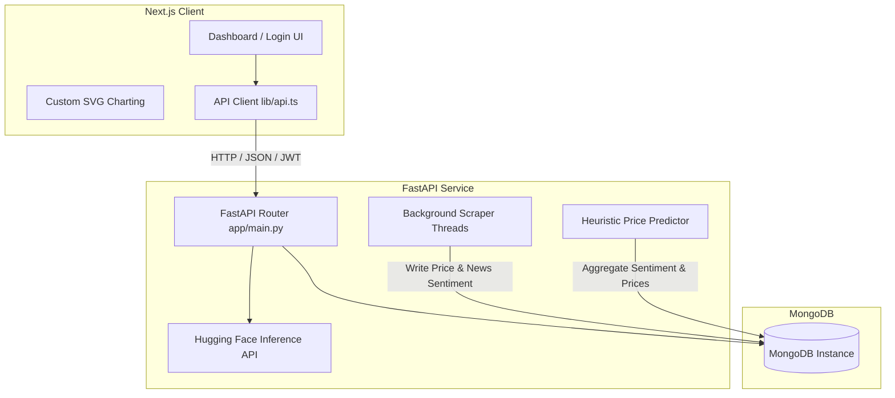
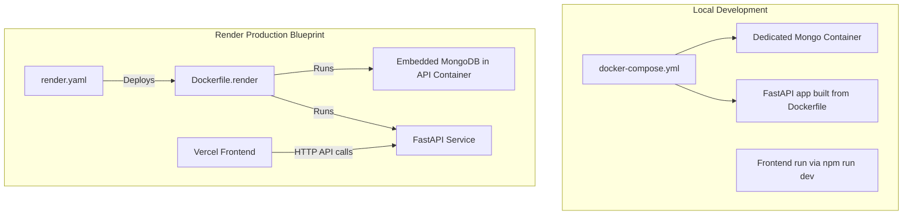

# Stock Predictor: Design Decisions & Deployment Strategies

This document provides a comprehensive breakdown of the architectural design decisions, technological stack choices, code patterns, and deployment strategies utilized in the **Stock Predictor & Sentiment Analyzer** application.

---

## 1. Architectural Overview

The application is structured as a decoupled client-server architecture:
*   **Backend (FastAPI)**: Serves a REST API, maintains stateful background worker threads for data collection, performs heuristic calculations, and connects to MongoDB.
*   **Frontend (Next.js)**: A single-page application built on Next.js (App Router) using React and custom vanilla styling. It visualizes stock/commodity prices, sentiment charts, and predictions.



---

## 2. Key Design Decisions

### A. Lightweight Background Threading Model
Instead of deploying a heavy distributed task queue like Celery or Dramatiq (which requires Redis/RabbitMQ as a broker), the backend uses native Python **`threading.Thread`** instances managed by:
*   `StockScraperManager` (in [scraper.py](file:///Users/saikrishnakuchimanchi/Documents/Test/stock_predictor/app/scraper.py)): Manages price scrapers per stock.
*   `SentimentScraperManager` (in [sentiment_scraper.py](file:///Users/saikrishnakuchimanchi/Documents/Test/stock_predictor/app/sentiment_scraper.py)): Manages RSS news scrapers per stock.

> [!NOTE]
> *   **Thread Safety**: A Python thread-lock (`threading.Lock`) protects dictionaries holding thread references to prevent concurrent modifications.
> *   **Cap Limit**: The system enforces an app-wide limit (`max_tracked_symbols`, default 200) to prevent CPU and memory exhaustion.
> *   **Idempotency**: Scrapers are launched on-demand when users search/track a symbol, but only one background thread is spawned per symbol globally.

---

### B. Transparent Heuristic Forecasting (Explainable AI)
Rather than executing resource-heavy ML models (like LSTM or transformer-based forecasting) which are slow and expensive, the application uses an **explainable linear trend + sentiment nudge model** (in [prediction.py](file:///Users/saikrishnakuchimanchi/Documents/Test/stock_predictor/app/prediction.py)):
1.  **Baseline Trend**: Fits a least-squares regression line (using `numpy.polyfit`) over the recent price points.
2.  **Sentiment Bias Nudge**: Computes the average news sentiment score ($s \in [-1.0, 1.0]$) over a lookback window (default 24 hours).
3.  **Slope Adjustment**: Multiplies the baseline trend slope by $(1.0 + W \times s)$, where $W$ is the configurable `prediction_sentiment_weight` (default `0.5`).
4.  **Floating-point Guardrails**: Snaps minor slopes (< 0.001) to exactly zero to avoid floating-point rendering artifacts on flat lines.

---

### C. Serverless AI Sentiment & Summarization
To support lightweight and cost-efficient hosting:
*   **Hugging Face Inference API**: Uses the serverless API endpoints to run `ProsusAI/finbert` for sentiment analysis and `facebook/bart-large-cnn` for text summarization.
*   **Graceful Degradation**: If the Hugging Face API token is missing or rate-limited, the system falls back to a deterministic rule-based keyword matcher for sentiment and outputs "summary unavailable" for summaries.

---

### D. Zero-Dependency SVG Charts
Rather than importing large JavaScript plotting libraries (like Recharts or Chart.js) which increase the frontend JS bundle size, the frontend features a custom **`<LineChart />`** SVG-based render:
*   Computes scale coordinates mathematically in React.
*   Uses `<path>` elements with smooth gradient fills for historical lines.
*   Uses dotted lines for future projections.
*   Guarantees fast paint times and no bundle bloat.

---

## 3. Database Schema

The system uses **MongoDB** with the following primary collections (initialized in [mongo.py](file:///Users/saikrishnakuchimanchi/Documents/Test/stock_predictor/app/mongo.py)):

| Collection | Description | Main Indexes |
| :--- | :--- | :--- |
| `users` | Stores accounts with hashed passwords. | Unique `username`, Unique `email` |
| `portfolio` | Tracks symbols in user portfolios. | Compound `{ user_id, symbol }` (Unique) |
| `wishlist` | Bookmarks symbols searched by users. | Compound `{ user_id, symbol }` (Unique) |
| `stock_prices` | Time-series data points for stock prices. | Compound `{ symbol, time }` |
| `sentiment_scores` | News article metadata and sentiment scores. | Compound `{ symbol, time }`, Unique `url` |

---

## 4. Deployment Strategies



### Strategy 1: Local Development (Docker Compose)
For local development, isolation and persistent state are key:
*   A dedicated MongoDB container runs with standard volume binding (`stockdb_mongo_data:/data/db`).
*   The FastAPI application is built using the standard [Dockerfile](file:///Users/saikrishnakuchimanchi/Documents/Test/stock_predictor/Dockerfile).
*   **Database Isolation**: `entrypoint.sh` detects that `MONGO_URI` is pointing to an external container (`mongodb://mongo:27017`) and **skips** starting the embedded MongoDB daemon.

```bash
# Run local environment
docker-compose up --build
```

### Strategy 2: Production Blueprint (Single Container on Render Free Tier)
To bypass the need for a separate database tier (which often requires credit-card verification on cloud providers), the project features a **dual-service-in-one-container** setup:

1.  **Render Blueprint (`render.yaml`)**:
    *   Specifies a single web service `stock-predictor-api` using `Dockerfile.render`.
    *   Generates a random secure `JWT_SECRET_KEY` automatically.
    *   Prompts the operator for the Hugging Face API Token (`HF_API_TOKEN`) and authorized CORS origins (`CORS_ALLOW_ORIGINS`).

2.  **Container Entrypoint Orchestration (`entrypoint.sh`)**:
    *   Detects if `MONGO_URI` points to `localhost` or is unset.
    *   Launches `mongod` locally inside the same container in the background (`--fork`).
    *   Runs a Python healthcheck script loop to wait for MongoDB to accept connections.
    *   Starts the `uvicorn` FastAPI web server.

> [!WARNING]
> **Ephemeral Storage Limitation**:
> Because Render's Free tier does not support persistent disks for free-plan containers and spins down instances after 15 minutes of inactivity, all database records (user signups, historical price records, scraped sentiments) are wiped upon container restart. This setup is optimized for demonstrations and review.
